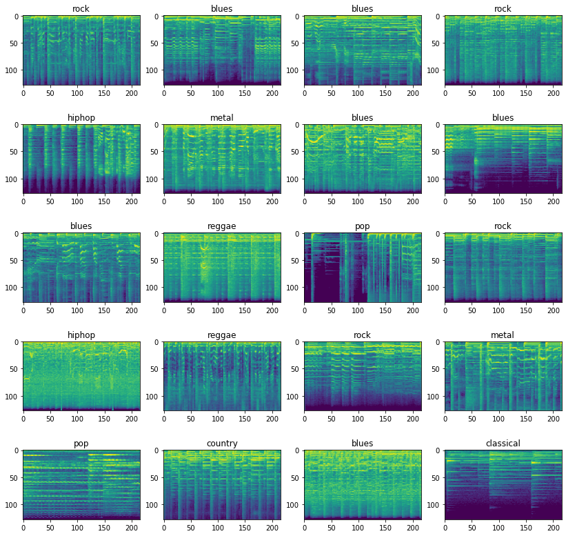

<div align="center">
  <a href="/"></a><br>


# MusicGenreClassification

collection of [Jupyter notebooks](https://jupyter.org/) all about detection and classification of Music.

</div>

[Music Genre Classification using MelSpectrogram]( 	MusicGenreClassification_melspectrogram.ipynb)

[Music Genre Classification MFCC]( 	MusicGenreClassification_MFCC.ipynb)

Alternatively, you can use [NBviewer](https://nbviewer.jupyter.org/) for better compatibility with tqdm widgets.


## prerequisites

[Conda](https://www.anaconda.com/) environment is saved to `environment.yml`

```bash
conda env create -f environment.yml
```

## References

[Mel-frequency cepstrum](https://en.wikipedia.org/wiki/Mel-frequency_cepstrum)

[Mel Frequency Cepstral Coefficient (MFCC)](http://practicalcryptography.com/miscellaneous/machine-learning/guide-mel-frequency-cepstral-coefficients-mfccs/)

[Music Genre Classification with Python by Parul Pandey at Medium](https://towardsdatascience.com/music-genre-classification-with-python-c714d032f0d8)
